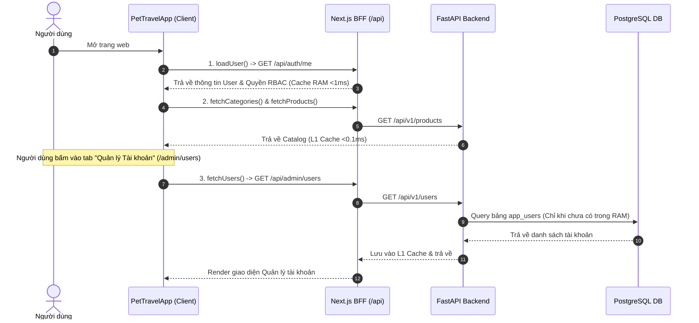

# Kiến Trúc Hệ Thống, Mô Hình Loader & Cơ Chế Nạp Trang
**Dự án**: Pet Travel Wholesale (B2B E-Commerce & ERP Platform)  
**Phiên bản**: 2.0 (App Router Architecture, L1 Cache & Realtime Revision Sync)

---

## 1. Kiến Trúc Tổng Thể Đa Tầng (End-to-End Multi-Layer Architecture)

```
[ Trình duyệt / Client (React 18 / Next.js) ]
       │
       │ (1) Điều hướng URL (Deep Linking hoặc Back/Forward)
       ▼
[ Next.js App Router Pages (`/admin/orders`, `/admin/users`, ...) ]
       │
       │ (2) Truyền initialTab & Khởi tạo State
       ▼
[ PetTravelApp Orchestrator (`PetTravelApp.tsx`) ]
       │
       │ (3) Nạp dữ liệu theo nhu cầu (On-Demand Fetching)
       ▼
[ Next.js BFF Server Layer (`/api/.../route.ts`) ]
       │  ├─ Lớp 1: In-Memory Session Cache (`userSessionCache`, TTL 60s, < 1ms)
       │  ├─ Lớp 2: Server Cache (`dbCache`, TTL 60s)
       │  └─ Bảo mật: Kiểm tra CSRF, Same-Origin, RBAC
       ▼
[ FastAPI Python Backend (`/api/v1/...`) ]
       │  ├─ Lớp 3: L1 In-Memory RAM Cache (`_orders_cache`, `_catalog_cache`, `_users_list_cache`, TTL 15-30s)
       │  └─ Tự động xóa cache tức thì (Instant Invalidation) khi có thay đổi
       ▼
[ Supavisor / PostgreSQL Connection Pooler (Transaction Mode) ]
       │
       ▼
[ PostgreSQL Database (Supabase AWS ap-south-1) ]
       ├─ Single-Query JSON Aggregation (Gom toàn bộ bảng con trong 1 lượt query, ~190ms)
       └─ Lightweight Revision Query (Tính chuỗi băm MD5 < 2ms)
```

---

## 2. Mô Hình Định Tuyến & Phân Trang (App Router & Bidirectional State Sync)

Hệ thống kết hợp sức mạnh của **Next.js App Router (phục vụ SEO & Deep Link)** và **React SPA State (chuyển đổi tab mượt mà không reload trang)**:

### A. Bản đồ Định tuyến (Routing Mapping Table)

| Đường dẫn URL | Component App Router | Tab tương ứng (`ActiveTab`) | Dữ liệu nạp chuyên biệt |
|---|---|---|---|
| `/` hoặc `/portal` | `frontend/src/app/page.tsx` | `products` | Danh mục & Sản phẩm sỉ |
| `/orders` | `frontend/src/app/orders/page.tsx` | `orders` | Lịch sử đơn hàng của đại lý |
| `/profile` | `frontend/src/app/profile/page.tsx` | `profile` | Thông tin tài khoản |
| `/admin` | `frontend/src/app/admin/page.tsx` | `admin` | Báo cáo doanh thu & Overview |
| `/admin/orders` | `frontend/src/app/admin/orders/page.tsx` | `admin_orders` | Đơn sỉ, Báo giá & Vận đơn |
| `/admin/products` | `frontend/src/app/admin/products/page.tsx` | `admin_products` | Kho hàng, Tồn kho & ATP |
| `/admin/categories`| `frontend/src/app/admin/categories/page.tsx` | `admin_categories` | Danh mục sản phẩm |
| `/admin/suppliers` | `frontend/src/app/admin/suppliers/page.tsx` | `admin_suppliers` | Danh sách Nhà cung cấp |
| `/admin/operations`| `frontend/src/app/admin/operations/page.tsx` | `admin_operations` | Fulfillment & Kho vận |
| `/admin/accounting`| `frontend/src/app/admin/accounting/page.tsx` | `admin_accounting` | Sổ cái & Nhật ký chung |
| `/admin/promotions`| `frontend/src/app/admin/promotions/page.tsx` | `admin_promotions` | Bảng giá, Chiết khấu & Quà tặng |
| `/admin/users` | `frontend/src/app/admin/users/page.tsx` | `admin_users` | Quản lý Tài khoản & Phân quyền |

### B. Cơ chế Đồng bộ 2 Chiều (Bidirectional Sync)
1. **Khi người dùng click chuyển menu**: `handleTabChange(tab)` gọi `window.history.pushState(null, "", route)` để đổi URL trên thanh địa chỉ mà không làm gián đoạn trạng thái ứng dụng.
2. **Khi người dùng bấm nút Back/Forward**: Sự kiện `window.addEventListener("popstate", ...)` tự động nhận diện URL mới và đổi `activeTab` tương ứng.
3. **Khi người dùng F5 hoặc dán link trực tiếp (Direct Deep Linking)**: Server render trang tương ứng với prop `initialTab`, khởi tạo đúng giao diện người dùng yêu cầu ngay từ đầu.

---

## 3. Vòng Đời Nạp Dữ Liệu Theo Nhu Cầu (On-Demand Data Loading Lifecycle)

Hệ thống **không nạp toàn bộ dữ liệu hệ thống cùng một lúc**, mà chia nhỏ việc nạp theo từng thời điểm:



### Các Endpoint nạp theo nhu cầu:
- **Trang chủ / Catalog**: Chỉ gọi `/api/categories` và `/api/products`.
- **Đơn hàng sỉ**: Chỉ kích hoạt `fetchOrders()`.
- **Sổ cái Kế toán**: Chỉ kích hoạt `fetchAccountingData()`.
- **Kho vận / Báo cáo**: Chỉ kích hoạt `fetchOperations()` / `fetchReports()`.
- **Tài khoản**: Chỉ kích hoạt `fetchUsers()`.

---

## 4. Cơ Chế Đồng Bộ Thời Gian Thực Siêu Nhẹ (Realtime Revision Broadcast & Authoritative Fetch)

Để đảm bảo dữ liệu luôn mới nhất mà không làm nghẽn Database:

1. **SSE Stream (`/api/orders/events`)**:
   - Server duy trì một kết nối Server-Sent Events nhẹ.
   - Mỗi 15 giây, server chỉ chạy **1 truy vấn băm siêu nhẹ**:
     $$\text{Revision Hash} = \text{MD5}\Big(\sum (\text{order\_id} : \text{updated\_at})\Big)$$
   - Server gửi gói tin chỉ vỏn vẹn **~32 bytes**:
     ```http
     event: orders.snapshot
     data: {"type":"orders.snapshot","revision":"e2fc714c4727ee9395f324cd2e7f331f"}
     ```
2. **Client-Side Comparison & Authoritative Fetch**:
   - Phía Browser giữ biến tham chiếu `lastRevisionRef`.
   - Khi nhận gói tin, Browser so sánh:
     ```ts
     if (payload.revision !== lastRevisionRef.current) {
       lastRevisionRef.current = payload.revision;
       void fetchOrders(); // Chỉ tải lại dữ liệu khi thực sự có đơn hàng thay đổi!
     }
     ```
   - Nếu không có thay đổi, **hoàn toàn không có bất kỳ request nặng nào được gửi lên server**.

---

## 5. Hệ Thống Bộ Nhớ Đệm Đa Tầng & Xóa Cache Tức Thì (Cache Invalidation Matrix)

| Loại dữ liệu | Tầng 1: Client State | Tầng 2: Next.js BFF | Tầng 3: FastAPI L1 RAM | Thời điểm Xóa Cache Tức thì (Invalidation) |
|---|---|---|---|---|
| **Phiên User / Quyền** | `currentUser` state | `userSessionCache` (60s) | In-Memory Token Verify | Khi Đăng xuất, Đổi mật khẩu, hoặc Xóa tài khoản |
| **Danh mục (Categories)**| `allCategories` | `dbCache['categories']` (60s) | RAM Database Bind | Khi Admin thêm/xóa/sửa danh mục |
| **Nhà cung cấp (Suppliers)**| `suppliers` | `dbCache['suppliers']` (60s) | RAM Database Bind | Khi Admin thêm/xóa/sửa NCC |
| **Sản phẩm (Catalog)** | `allProducts` | Next.js Page Stale-While-Revalidate | `_catalog_cache` (30s) | Khi Admin lưu sản phẩm, sửa biến thể, hoặc tắt sản phẩm |
| **Đơn hàng (Orders)** | `allOrders` | `dbCache['orders']` | `_orders_cache` (15s) | Khi Tạo đơn, Duyệt báo giá, Đổi trạng thái, Thêm bình luận |
| **Tài khoản (Users List)**| `userList` | `dbCache['app_users']` (60s) | `_users_list_cache` (30s) | Khi Tạo mới tài khoản, Sửa hồ sơ, hoặc Xóa tài khoản |

---

## 6. Tối Ưu Hóa Truy Vấn Cơ Sở Dữ Liệu (PostgreSQL Single-Query Aggregation)

### Trước khi tối ưu (N+1 Sequential Roundtrips):
- 1 lượt nạp danh sách đơn hàng thực hiện **11 câu query SQL tuần tự**: `customer_orders` $\rightarrow$ `order_items` $\rightarrow$ `quote_versions` $\rightarrow$ `payment_requests` $\rightarrow$ `order_comments` $\rightarrow$ `fulfillment_groups` $\rightarrow$ `shipments` $\rightarrow$ `quote_adjustments` $\rightarrow$ `payment_proofs` $\rightarrow$ `fulfillment_items` $\rightarrow$ `journal_entries`.
- Tổng thời gian: **8,273 ms (8.27 giây)**.

### Sau khi tối ưu (Single-Query JSON Aggregation):
- Gom toàn bộ các bảng quan hệ vào 1 câu SQL duy nhất bằng Common Table Expressions (CTE) và hàm PostgreSQL `json_agg` / `json_build_object`.
- Xử lý hoàn toàn trong bộ nhớ C của PostgreSQL và trả về kết quả trong **1 lượt mạng duy nhất**.
- Tổng thời gian: **~190 ms (nhanh hơn 43 lần)**.
- Khi truy cập lần 2 (L1 RAM Cache): **< 0.1 ms (gần như 0 giây)**.
