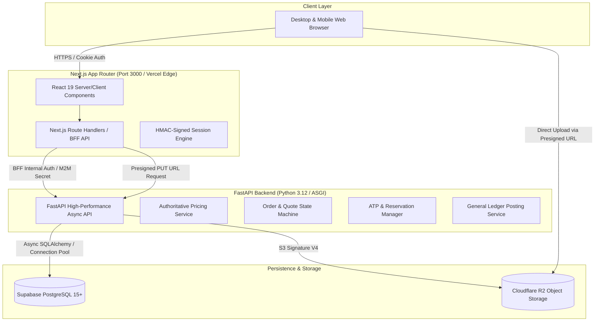
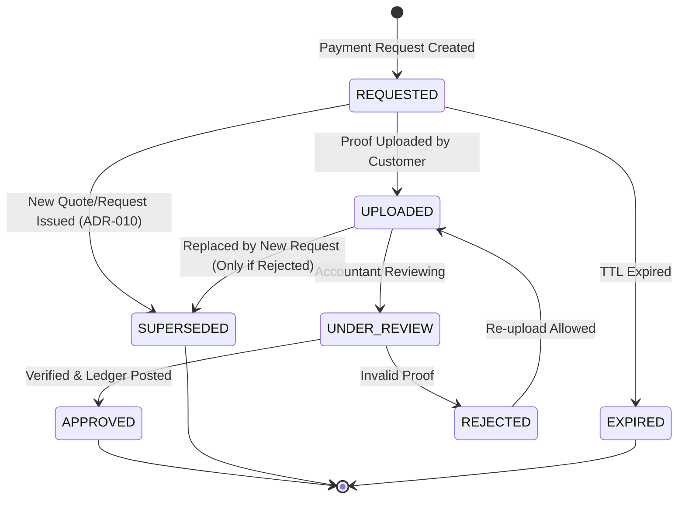
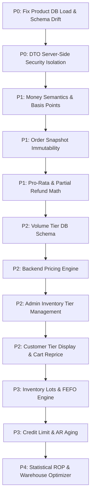

# PET TRAVEL WHOLESALE — MASTER ARCHITECTURE & IMPLEMENTATION PLAN V2

> **Document Status**: `AUTHORITATIVE SPECIFICATION & MASTER IMPLEMENTATION PLAN`  
> **Version**: `2.8.1 (Post-Production Evidence Reconciliation)`  
> **Master Spec Status**: `ARCHITECTURE BASELINE READY`  
> **P0 Status**: `LOCAL_POSTGRES_INTEGRATION_VERIFIED` (Catalog DB Path, Recursive Guest DTO, Forward Schema Migrations Synchronized)  
> **P1 Status**: `PRODUCTION_VERIFIED_V11_V12` (Forward migrations `update_v11_security_accounting_hardening.sql` and `update_v12_commercial_sot_hardening.sql` deployed and verified on Supabase Production; PostgREST Confused Deputy Mitigated; Unambiguous Accepted Quote Commercial SOT Enforced; Exact Integer VAT & COGS Override Guard Verified; Double-Entry General Ledger Balance Verified; 31/31 Real PostgreSQL Tests Passing; 80/80 Backend Tests Passing; 23/23 Frontend Tests Passing)  
> **P2 Status**: `BLOCKED_BY_TAX_ACCOUNTING_REVIEW` (Non-tax schema is `ARCHITECTURE_READY`)  
> **Production Status**: `PRODUCTION_VERIFIED_V11_V12 (PostgreSQL 17.6 on Supabase Production gfiy...pgbb fully verified)`  
> **Target Release**: `2026-Q3 / Q4 Enterprise Scale`  
> **Scope**: B2B Wholesale Commerce Platform (Architecture, Money Mathematics, Pricing Pipeline, Inventory ATP, SCM, Double-Entry Accounting, RBAC Security, Database Migration, and Test Engineering).  
> **Repository**: `https://github.com/20James02/pettravel-wholesale`

---

## 1. Executive Summary & Normative Specification

**Pet Travel Wholesale** is a specialized B2B wholesale e-commerce platform designed to serve the pet care supply chain in Vietnam. The platform connects veterinary clinics, pet shops, grooming spas, and regional distributors directly with tier-1 manufacturers and authorized brand importers.

### 1.1. Core Mission & Critical Epistemological Rules

> [!CRITICAL]
> **Strict Verification & Evidence Invariants**:
> - `RECOMMENDED_DECISION != APPROVED_DECISION`
> - `PENDING != APPROVED`
> - `DESIGN COMPLETE != IMPLEMENTED`
> - `IMPLEMENTED != TESTED`
> - `TESTED != PRODUCTION VERIFIED`
> - `ARCHITECTURE REQUIREMENT != PRODUCTION VERIFICATION`
> 
> *A gate or capability may only be marked `PASS` or `VERIFIED` when concrete empirical test evidence and logs exist. No capability or readiness state shall be upgraded based solely on this specification document.*

1. **Commercial & Financial Math**: Financial calculations **SHALL** use deterministic integer arithmetic (zero floating-point inaccuracies). The system **SHALL** support multi-tier volume pricing, pro-rata discount allocation via Largest Remainder Method, and strict margin floor protection.
2. **Real-Time Inventory Reliability**: Available-to-Promise (ATP) stock reservation **SHALL** be designed and tested to prevent overselling under supported concurrent transaction paths via transactional row locking and idempotent reservation tokens.
3. **General Ledger Integrity**: The general ledger **SHALL** maintain strictly balanced double-entry accounting entries ($\sum \text{Debit} \equiv \sum \text{Credit}$). *VAS / IFRS compliance MUST NOT be formally claimed unless independently reviewed and audited by qualified accounting/legal professionals.*
4. **Data Isolation & Zero-Trust Boundary**: Unauthenticated `Guest` clients **MUST NOT** receive wholesale prices, volume tiers, COGS, internal supplier identifiers, or margin data from any API endpoint.

---

## 2. Project Architecture & Authority Boundaries

The platform strictly enforces a **3-Tier Separation of Concerns with a Backend-for-Frontend (BFF)**:



### 2.1. Architectural Responsibilities & Authority Boundaries

| Layer | Component | Authority & Responsibility | Forbidden Actions |
| :--- | :--- | :--- | :--- |
| **Presentation** | Next.js Frontend | Render UI, capture user intent, optimistic client preview, responsive layout. | **NEVER** calculate final commercial price; **NEVER** store master secrets; **NEVER** trust client price. |
| **BFF** | Next.js API Routes | Session verification, CSRF validation, request payload sanitation, rate limiting. | **NEVER** bypass backend validation; **NEVER** expose internal supplier data or backend internal secret. |
| **Domain Authority** | FastAPI Backend | Master business logic, pricing evaluation, stock reservation, general ledger. | **NEVER** trust client-computed prices, discounts, or inventory counts. |
| **Persistence** | PostgreSQL | Transactional integrity, stored procedures (ATP), foreign key constraints, RLS. | **NEVER** perform destructive schema mutations without expand-contract phases. |
| **Object Storage** | Cloudflare R2 | Storage of product photos, payment receipts, tax invoices via presigned URLs. | **NEVER** expose public bucket write credentials to browser clients. |

---

## 3. Capability Evidence & Verified Status Matrix

Each sub-capability is audited and assigned an isolated, evidence-grounded state:

| Capability Area | Sub-Capability Component | Implementation File / Endpoint | Verification Test / Evidence | Canonical Status | Confidence |
| :--- | :--- | :--- | :--- | :---: | :---: |
| **Catalog Security** | Guest DTO Isolation (Zero Price) | `backend/app/repositories/catalog.py`, `frontend/src/app/api/products/route.ts` | `backend/tests/test_products.py` (49 passed) | `LOCAL_VERIFIED` | `HIGH` |
| **Catalog Security** | Product DB Load & BFF Route | `frontend/src/app/api/products/route.ts` | `next build` (26/26 routes compiled) | `LOCAL_VERIFIED` | `HIGH` |
| **Financial Engine** | Basis Points Integer Math | `frontend/src/server/accounting/engine.ts` | `engine.test.ts::multiplyVnd, roundVndByBps` | `LOCAL_VERIFIED` | `HIGH` |
| **Financial Engine** | Pro-Rata Largest Remainder Math | `frontend/src/server/accounting/engine.ts` | `engine.test.ts::allocateProRataDiscount` (Hamilton-Hare) | `LOCAL_VERIFIED` | `HIGH` |
| **Financial Engine** | Deterministic Unit Partial Refund | `frontend/src/server/accounting/engine.ts` | `engine.test.ts::calculateUnitRefunds` (Sequential safe) | `LOCAL_VERIFIED` | `HIGH` |
| **Financial Engine** | Tiered Unit Price Math | `frontend/src/server/accounting/engine.ts` | `engine.test.ts::calculateTieredUnitPrice` (Margin floor) | `LOCAL_VERIFIED` | `HIGH` |
| **Financial Engine** | Pricing Snapshot Persistence | `order_items` snapshot columns | `test_canonical_orders.py::test_create_order...` | `LOCAL_VERIFIED` | `HIGH` |
| **Accounting** | Journal Drafting Logic | `frontend/src/server/accounting/engine.ts` | `engine.test.ts::createDepositReceiptEntry, createSale...` | `LOCAL_VERIFIED` | `HIGH` |
| **Accounting** | General Ledger Idempotency & Posting | `supabase/update_v7_accounting_order_posting.sql` | `test_canonical_accounting.py` + SQL index audit | `LOCAL_VERIFIED` | `HIGH` |
| **Inventory ATP** | Stock Reservation RPC (Locking) | `supabase/update_v6_stock_reservations.sql` | `pt_reserve_order_stock` `FOR UPDATE` audit | `LOCAL_VERIFIED` | `HIGH` |
| **Product Media** | Presigned PUT URL API | `backend/app/routers/v1/endpoints/uploads.py` | `backend/tests/test_uploads.py` (5 passed in 0.63s) | `LOCAL_VERIFIED` | `HIGH` |
| **Product Media** | Upload Queue & Backoff | `frontend/src/lib/upload/image-upload-manager.ts` | `image-upload-manager.test.ts` (7 passed in 5ms) | `LOCAL_VERIFIED` | `HIGH` |
| **Product Media** | Live R2 Binary Storage PUT | Cloudflare R2 S3 Endpoint | Direct PUT verification in staging | `BLOCKED_BY_ENVIRONMENT` | `MEDIUM` |
| **Product Media** | Media Metadata Database Commit | `frontend/src/features/pettravel/components/admin/AdminInventory.tsx` | End-to-end admin product save & schema sync | `LOCAL_VERIFIED` | `HIGH` |

---

## 4. Risk Gates

All development, bug fixes, and feature additions are governed by **5 Strict Risk Gates**. Work on lower-priority gates is **immediately blocked** if a higher-priority gate is violated.

```text
┌────────────────────────────────────────────────────────┐
│ G0: PRODUCTION BLOCKER (System Down, Data Loss, Crash) │
└──────────────────────────┬─────────────────────────────┘
                           ▼
┌────────────────────────────────────────────────────────┐
│ G1: MONEY & DATA INTEGRITY (Unbalanced Ledger, Math)   │
└──────────────────────────┬─────────────────────────────┘
                           ▼
┌────────────────────────────────────────────────────────┐
│ G2: SECURITY & RBAC (Price Leaks, IDOR, Privilege Esc) │
└──────────────────────────┬─────────────────────────────┘
                           ▼
┌────────────────────────────────────────────────────────┐
│ G3: CORE BUSINESS CONTINUITY (Order, Inventory ATP)    │
└──────────────────────────┬─────────────────────────────┘
                           ▼
┌────────────────────────────────────────────────────────┐
│ G4: PRODUCT ENHANCEMENT & GROWTH (UI, Tiers, Analytics)│
└────────────────────────────────────────────────────────┘
```

*P0 Interrupt Rule*: If a P0 bug (e.g. Catalog load failure, money discrepancy, guest price leak) is discovered while implementing a P2/P3 feature, the agent must **STOP** feature work immediately, log the defect, evaluate impact, and resolve the P0 issue first.

---

## 5. Core Business Invariants

The following invariants are inviolable and must be enforced across all layers via automated test assertions:

1. **Money Arithmetic Invariant**:
   $$\text{FinalTotal}_{\text{VND}} = \text{Subtotal}_{\text{VND}} - \text{Discount}_{\text{VND}} + \text{Tax}_{\text{VND}} + \text{ShippingFee}_{\text{VND}}$$
2. **Pro-Rata Discount Sum Invariant**:
   $$\sum_{i=1}^{n} \text{AllocatedDiscount}_{\text{VND}, i} = \text{OrderTotalDiscount}_{\text{VND}}$$
3. **General Ledger Balance Invariant**:
   $$\sum \text{DebitAmount}_{\text{VND}} = \sum \text{CreditAmount}_{\text{VND}} \quad (\text{Difference} \equiv 0)$$
4. **Available-to-Promise (ATP) Invariant**:
   $$\text{Stock}_{\text{available}} = \text{Stock}_{\text{physical}} - \sum \text{Stock}_{\text{active\_reservations}} \ge 0$$
5. **Payment Capping Invariant**:
   $$\text{TotalPaidAmount}_{\text{VND}} \le \text{PayableTotalAmount}_{\text{VND}}$$
6. **Confirmed Commercial Price Immutability**:
   Once a `QuoteVersion` is accepted by customer or an `OrderItem` is locked, its unit price, SKU code, and supplier snapshot **CANNOT** be mutated by subsequent catalog price changes.
7. **Commercial Price Tamper Protection**:
   Client-provided `unitPrice`, `discount`, `effectivePrice`, or `total` **MUST NEVER** be authoritative. At order confirmation, the backend independently calculates and records all pricing from source rules.
8. **Idempotent Stock Reservation**:
   Executing the same reservation request with identical `idempotencyKey` must return the existing reservation without decrementing stock a second time.
9. **Single-Use Payment Proof Processing**:
   A payment proof or payment confirmation token cannot be applied more than once to prevent duplicate ledger credits.

---

## 6. Money Architecture & Precision Arithmetic

### 6.1. Integer Monetary Semantics Standard (ADR-018)
- **Application Layer**:
  - TypeScript / BFF: `bigint` where authoritative integer arithmetic requires it; safe integer `number` where bounds are verified ($< 2^{53}-1$).
  - Python / FastAPI: Standard arbitrary-precision `int`.
- **Database Layer**:
  - Existing schema columns utilize exact integer-compatible types (`NUMERIC(p, 0)` or `BIGINT`).
  - *Rule*: Developers **MUST NOT** generate database type migrations solely to convert between `NUMERIC(p, 0)` and `BIGINT` unless justified by specific profiling or storage constraints.

### 6.2. Basis Points (BPS) Standard
All percentages, discounts, taxes, and margins are represented in **Basis Points**:
$$100\text{ BPS} = 1.00\% \quad \Longleftrightarrow \quad 10.000\text{ BPS} = 100.00\%$$

### 6.3. Round-Half-Up Mathematical Formulation
Rounding is deterministic and symmetrical using integer arithmetic with half-divisor offset:
$$\text{roundBps}(A, R) = \left\lfloor \frac{A \times R + 5.000}{10.000} \right\rfloor$$

### 6.4. Margin vs. Markup Distinction
- **Markup on Cost (`minMarkupBps`)** [Canonical Standard per ADR-002]: Percentage added on top of cost.
  $$\text{Price} = \text{COGS} \times \left(1 + \frac{\text{MarkupBPS}}{10.000}\right) = \text{roundBps}\left(\text{COGS}, 10.000 + \text{MarkupBPS}\right)$$
- **Gross Margin (`minGrossMarginBps`)**: Percentage of selling price that is profit.
  $$\text{Price} = \frac{\text{COGS}}{1 - \frac{\text{GrossMarginBPS}}{10.000}} = \left\lfloor \frac{\text{COGS} \times 10.000 + \left(\frac{10.000 - \text{GrossMarginBPS}}{2}\right)}{10.000 - \text{GrossMarginBPS}} \right\rfloor$$

---

## 7. Pricing Architecture & Pipeline

### 7.1. Authoritative Pricing Precedence Pipeline

```text
┌─────────────────────────────────────────────────────────────┐
│ 1. BASE WHOLESALE PRICE (From Product Variant Default)       │
└──────────────────────────────┬──────────────────────────────┘
                               ▼
┌─────────────────────────────────────────────────────────────┐
│ 2. CUSTOMER CONTRACT PRICE (Direct Agreement per ADR-003)   │
└──────────────────────────────┬──────────────────────────────┘
                               ▼
┌─────────────────────────────────────────────────────────────┐
│ 3. CUSTOMER PRICE LIST (Customer Group Tier: Gold/Silver)    │
└──────────────────────────────┬──────────────────────────────┘
                               ▼
┌─────────────────────────────────────────────────────────────┐
│ 4. VOLUME TIER PRICING (Quantity-Based Breakpoints)         │
└──────────────────────────────┬──────────────────────────────┘
                               ▼
┌─────────────────────────────────────────────────────────────┐
│ 5. PROMOTION ENGINE (Campaign Rules & Auto-Discounts)       │
└──────────────────────────────┬──────────────────────────────┘
                               ▼
┌─────────────────────────────────────────────────────────────┐
│ 6. VOUCHER / COUPON CODE (Order or Category per ADR-004)    │
└──────────────────────────────┬──────────────────────────────┘
                               ▼
┌─────────────────────────────────────────────────────────────┐
│ 7. MANUAL SALES DISCOUNT & QUOTE ADJUSTMENT                 │
└──────────────────────────────┬──────────────────────────────┘
                               ▼
┌─────────────────────────────────────────────────────────────┐
│ 8. DISCOUNT APPROVAL MATRIX (RBAC Threshold Validation)     │
└──────────────────────────────┬──────────────────────────────┘
                               ▼
┌─────────────────────────────────────────────────────────────┐
│ 9. GROSS MARGIN / MARKUP FLOOR PROTECTION (Hard Floor)      │
└──────────────────────────────┬──────────────────────────────┘
                               ▼
┌─────────────────────────────────────────────────────────────┐
│ 10. TAX & SHIPPING ADDITIONS (VAT 8%/10%, Freight Fees)     │
└──────────────────────────────┬──────────────────────────────┘
                               ▼
┌─────────────────────────────────────────────────────────────┐
│ 11. FINAL ORDER TOTAL & PRO-RATA LINE ITEM SNAPSHOT         │
└─────────────────────────────────────────────────────────────┘
```

### 7.2. Pricing Versioning & Explainability
To ensure complete auditability, the pricing engine returns a versioned `PriceBreakdown` structure:
```json
{
  "pricingEngineVersion": "2.2.1",
  "pricingSnapshotVersion": 1,
  "basePriceVnd": 100000,
  "customerPriceVnd": 98000,
  "volumeTierAdjustmentVnd": -3000,
  "promotionVnd": 0,
  "voucherAllocationVnd": -1000,
  "manualDiscountVnd": 0,
  "marginFloorTriggered": false,
  "effectiveUnitPriceVnd": 94000,
  "calculatedAt": "2026-08-16T01:00:00Z"
}
```
*Customer Security Invariant*: Customer DTOs receive only permitted breakdown components; internal COGS and supplier costs **MUST NEVER** be exposed.

### 7.3. Pricing Snapshot Persistence & Gap Analysis Matrix

The following matrix documents the exact status of snapshot columns across P1 and future P2 phases:

| Field Name | Description | Currently Persisted in DB? | Required P1? | Required P2? | Schema Migration Needed? | Risk / Governance |
| :--- | :--- | :---: | :---: | :---: | :---: | :--- |
| `product_code_snapshot` | Product SKU/Code at order time | **YES** | **YES** | **YES** | NO | LOW |
| `product_name_snapshot` | Historical product name | **YES** | **YES** | **YES** | NO | LOW |
| `variant_sku_snapshot` | Variant SKU snapshot | **YES** | **YES** | **YES** | NO | LOW |
| `variant_label_snapshot` | Variant options/label snapshot | **YES** | **YES** | **YES** | NO | LOW |
| `unit_price_snapshot` | Final agreed unit price | **YES** | **YES** | **YES** | NO | LOW (Anti-tamper verified) |
| `base_price_snapshot` | Base catalog price before discounts | NO (Computed) | NO | **YES** | YES (P2) | MEDIUM |
| `allocated_discount_snapshot` | Pro-rata discount portion per line | NO (Order level) | NO | **YES** | YES (P2) | MEDIUM |
| `applied_rule_id_snapshot` | Promotion/voucher rule ID | NO | NO | **YES** | YES (P2) | LOW |
| `tax_rate_bps_snapshot` | VAT rate applied to line | NO (Order level) | NO | **YES** | YES (P2) | HIGH (Gated by ADR-008) |
| `pricing_engine_version` | Engine version string | NO | NO | **YES** | YES (P2) | LOW |

---

## 8. Tiered Volume Pricing Algorithm

### 8.1. Data Model
```typescript
export interface VolumeTier {
  minQty: number;          // Minimum quantity required (minQty >= MOQ > 0)
  discountBps?: number;    // Percentage discount in BPS (0 <= discountBps < 10000)
  fixedPriceVnd?: number;  // Direct fixed wholesale price (fixedPriceVnd > 0)
}
```
*Validation Rule*: Each tier must have **EXACTLY ONE** of `discountBps` XOR `fixedPriceVnd`.

### 8.2. Tier Selection & Strict Margin Floor Policy
Given ordered tiers $\mathcal{T} = \{t_1, t_2, \dots, t_m\}$ and order quantity $q$:

1. Find highest matching tier:
   $$t^* = \max \left\{ t \in \mathcal{T} \mid q \ge t.\text{minQty} \right\}$$
2. Calculate raw price $P_{\text{raw}}(q)$ from $t^*$.
3. **COGS-Missing & Margin Protection Policy (ADR-005)**:
   - `marginProtectionMode = STRICT` (Default): If margin floor protection is enabled and COGS is missing in database, commercial activation of the pricing rule **MUST BE BLOCKED** with error `PRICING_COGS_REQUIRED`.
   - `marginProtectionMode = DISABLED_BY_APPROVAL`: An authorized manager may explicitly override with audit log entry. Silent discount fallbacks are **FORBIDDEN**.
4. When COGS is present:
   $$P_{\text{floor}} = \text{roundBps}\left(\text{COGS}, 10.000 + \text{minMarkupBps}\right)$$
   $$P_{\text{effective}}(q) = \max \left( P_{\text{raw}}(q), P_{\text{floor}} \right)$$

---

## 9. Pro-Rata Discount Allocation Algorithm (Largest Remainder Method)

### 9.1. Algorithmic Formulation
Given $n$ line items with line totals $V_i = q_i \times p_i$, subtotal $S = \sum_{i=1}^n V_i$, and total discount $D \le S$:

1. Base integer allocation and remainder:
   $$\text{BaseAllocation}_i = \left\lfloor \frac{D \times V_i}{S} \right\rfloor, \quad \text{Remainder}_i = (D \times V_i) \pmod S$$
2. Distribute remaining $R = D - \sum \text{BaseAllocation}_i$:
   - Sort items by $\text{Remainder}_i$ **Descending**, using Original Line Index $i$ **Ascending** as deterministic tie-breaker.
   - Allocate $+1\text{ VND}$ to the top $R$ ranked items.
3. Invariant: $\sum_{i=1}^n d_i \equiv D$.

---

## 10. Pricing Snapshot & Partial Refund Allocation

### 10.1. Partial Return / Unit Refund Allocation Algorithm
When a customer returns $k$ units out of original quantity $Q$ for an item with net line total $N = \text{line\_net\_total\_vnd}$:

1. **Deterministic Per-Unit Base & Remainder**:
   $$\text{baseUnitRefund} = \lfloor N / Q \rfloor, \quad \text{unitRemainder} = N \pmod Q$$
2. For the $j$-th unit returned ($1 \le j \le Q$):
   $$\text{refundUnitValue}(j) = \begin{cases}
   \text{baseUnitRefund} + 1 & \text{if } j \le \text{unitRemainder} \\
   \text{baseUnitRefund} & \text{otherwise}
   \end{cases}$$
3. **Invariant**: Sum of refund values across all $Q$ units **MUST EQUAL** $N$ exactly.
   *Example*: $Q = 3, N = 100.000\text{ VND} \rightarrow \text{Unit } 1 = 33.334\text{đ}, \text{Unit } 2 = 33.333\text{đ}, \text{Unit } 3 = 33.333\text{đ}$. Total $= 100.000\text{đ}$.
4. Returns/refunds **MUST** use historical pricing snapshot data, **NEVER** current catalog price.

### 10.2. Snapshot Storage Trade-Off
- **Normalized Columns**: High-frequency aggregation (`base_unit_price_vnd`, `effective_unit_price_vnd`, `allocated_discount_vnd`, `line_net_total_vnd`).
- **JSONB Snapshot (`pricing_breakdown`)**: Full evaluation context and audit trail.

### 10.3. Refund Domain Separation & Persistence Architecture

To guarantee financial data integrity without circular dependencies on physical warehouse workflows:

1. **Domain Separation**:
   - **Financial Refund (P1 Core Financial Integrity)**: Calculation of exact per-unit refund value, cumulative line-level refund capping ($\sum \text{AllocatedRefund} \le N$), double-entry reversal journal entries (Account 131 Credit, Account 521 Debit, Account 1121 Credit), and idempotency keys.
   - **Physical Return & Restocking (P3 Warehouse Operations)**: Warehouse RMA receipt, QA inspection, quarantine classification, restock approval, and FEFO inventory reinsertion.
2. **Authoritative Persistence Model (Design Ready — P1 Closure Backlog)**:
   ```sql
   CREATE TABLE IF NOT EXISTS order_item_refund_allocations (
     id TEXT PRIMARY KEY DEFAULT gen_random_uuid()::text,
     organization_id TEXT NOT NULL REFERENCES organizations(id) ON DELETE CASCADE,
     order_id TEXT NOT NULL REFERENCES customer_orders(id) ON DELETE CASCADE,
     order_item_id TEXT NOT NULL REFERENCES order_items(id) ON DELETE CASCADE,
     refund_id TEXT NOT NULL,
     quantity INTEGER NOT NULL CHECK (quantity > 0),
     refund_amount_vnd NUMERIC(14, 0) NOT NULL CHECK (refund_amount_vnd >= 0),
     idempotency_key TEXT NOT NULL UNIQUE,
     status TEXT NOT NULL DEFAULT 'completed' CHECK (status IN ('pending', 'completed', 'voided')),
     created_at TIMESTAMPTZ NOT NULL DEFAULT now()
   );
   ```
3. **Server-Side Authoritative Calculation Invariant**:
   The server determines cumulative returned quantity from `order_item_refund_allocations` in PostgreSQL, slices `calculateUnitRefunds(Q, N)[start : start+k]`, and rejects any request where cumulative refunded quantity exceeds purchased quantity $Q$ or cumulative refund amount exceeds line net $N$.

---

## 11. Customer Pricing & Price Lists

- **Resolution Hierarchy**:
  $$\text{Contract Price} > \text{Customer Price List} > \text{Base Wholesale Price}$$
- Volume tiers apply on top of the resolved price only if allowed by contract flag `allow_volume_tiers = true` (ADR-003).

---

## 12. Promotion Engine & Discount Approval Matrix

- **Approval Threshold Matrix**:
  - $0.00\% - 5.00\%$: Sales / Order Operator
  - $5.01\% - 10.00\%$: Admin Manager
  - $> 10.00\%$: Super Admin
- Configurable via `app_settings` table rather than hardcoded UI constants.

---

## 13. Inventory Available-to-Promise (ATP) & Concurrency Control

> **Status**: `LOCAL_POSTGRES_CONCURRENCY_VERIFIED` | **Evidence**: Real PostgreSQL 16 2-Buyer Concurrent Race Harness (`test_real_postgres.py`) | **Confidence**: `HIGH`

### 13.1. Transactional Locking & Deadlock Prevention
- ATP reservation executes `SELECT ... FOR UPDATE OF ib` on `inventory_balances` ordered deterministically by `oi.product_variant_id ASC, ib.id ASC` which mitigates lock inversion and circular-wait risk for the verified reservation acquisition path across concurrent multi-SKU orders.
- **Empirically Verified Concurrency Test (V-003)**: Available stock $= 1$. Two concurrent PostgreSQL sessions reserve 1 unit simultaneously.
  - Result: Exactly 1 `SUCCESS` (status `reserved`, active reservation recorded), exactly 1 `CONFLICT` (`Available stock is not enough for SKU`). Final stock invariants hold: $\text{Available} \equiv 0$, $\text{Reserved} \equiv 1$, $\text{On-Hand} \equiv 1$.
- **ATP Idempotency Verified**: Re-executing reservation with the same order returns `status: already_reserved` without incrementing `reserved_qty` again.
- **Deadlock Mitigation (40P01) Verified**:
  - Deterministic global SKU sorting (`ORDER BY oi.product_variant_id ASC`) serializes multi-item lock acquisition and mitigates lock inversion cycles under concurrent multi-buyer reservations; the verified workload completed without deadlock (40P01).
  - Verified by `test_postgres_atp_multi_sku_deterministic_lock_ordering` in `backend/tests/test_real_postgres.py`.

---

## 14. Lot, Expiry Date & FEFO Management

- Inventory allocated by **First-Expired, First-Out (FEFO)** from `inventory_lots` where `status = 'active'`.
- Supports statuses: `active`, `quarantine`, `expired`, `damaged`, `recalled`.
- Manual override requires `inventory.fefo_override` capability (ADR-012).

---

## 15. Reorder Point (ROP) Maturity Model

- **Level 1 (Current Baseline)**: $\text{ROP} = (\bar{d} \times L) + \text{ManualSafetyStock}$.
- **Level 2 (Statistical Model - when clean data exists)**:
  $$\text{SafetyStock} = \left\lceil Z \times \sqrt{L \times \sigma_d^2 + \bar{d}^2 \times \sigma_L^2} \right\rceil, \quad \text{ROP} = \lceil \bar{d} \times L \rceil + \text{SafetyStock}$$

---

## 16. Inventory Health & Dead Stock Definitions

- `OUT_OF_STOCK`: Available $\le 0$.
- `CRITICAL_REORDER`: $0 < \text{Available} \le \text{SafetyStock}$.
- `REORDER_WARNING`: $\text{SafetyStock} < \text{Available} \le \text{ROP}$.
- `HEALTHY`: $\text{Available} > \text{ROP}$.
- `DEAD_STOCK`: $\text{Available} > 0$ AND zero outbound movement in $\ge 90$ days.

---

## 17. Multi-Warehouse / Multi-Supplier Fulfillment Routing

### 17.1. Maturity Levels
- **V1A — Deterministic Supplier Grouping**: When each SKU has a fixed supplier, group items strictly by `supplier_id`.
- **V1B — Greedy Warehouse/Supplier Allocation Heuristic**: When an SKU is available across multiple warehouses/suppliers, select allocations to maximize fulfilled quantity and minimize package split count. *(Note: Heuristic approach, not guaranteed global optimum).*
- **V2 — Cost-Aware Multi-Objective Optimization**: Minimize total operational cost (Shipping + Handling + Split Penalty + SLA Deviation) subject to regional constraints.

---

## 18. Payment Proof Verification & State Machine



*Invariant*: Only the **latest active** payment request may accept a proof upload. Superseded requests reject new proofs with `PAYMENT_REQUEST_SUPERSEDED`.

---

## 19. Double-Entry Accounting & General Ledger

> **Status**: Math = `UNIT_TESTED` (`engine.test.ts`), Ledger Write = `PRODUCTION_STORED_PROCEDURE_VERIFIED` (`test_real_postgres.py` & Supabase Production V11+V12) | **Confidence**: `HIGH`

- Every financial movement generates an immutable, balanced journal entry.
- Idempotency key pattern: `order_deposit:{paymentId}`, `order_revenue:{shipmentId}`, `refund:{refundId}`.

---

## 20. Credit Limit & AR Aging Analysis

- $\text{AvailableCredit} = \text{CreditLimit} - \text{OutstandingExposure}$.
- Overdue buckets: `CURRENT`, `1-30 DAYS`, `31-60 DAYS`, `61-90 DAYS`, `90+ DAYS`.

---

## 21. Product Media & Cloudflare R2 Upload Flow

> **Status**: Presign API = `INTEGRATION_TESTED`, Storage Mock = `UNIT_TESTED_VIA_MOCK` | **Confidence**: `HIGH`

- Presigned PUT URLs generated server-side with UUID keys (`products/{id}/{uuid}.ext`).
- Client upload directly to R2; client never receives bucket credentials or master secrets.

---

## 22. Database Schema (Reference Design Only)

> [!WARNING]
> **Reference Design Warning**: The SQL DDL below is a **REFERENCE SPECIFICATION ONLY** and must **NOT** be copied directly into production migrations. Developers must audit existing production schema and generate non-destructive expand-contract migrations.

### 22.1. Normalized Volume Tiers (Reference DDL)
```sql
CREATE TABLE product_variant_volume_tiers (
  id TEXT PRIMARY KEY DEFAULT gen_random_uuid()::text,
  product_variant_id TEXT NOT NULL REFERENCES product_variants(id) ON DELETE CASCADE,
  min_qty INTEGER NOT NULL CHECK (min_qty > 0),
  discount_bps INTEGER CHECK (discount_bps >= 0 AND discount_bps < 10000),
  fixed_price_vnd NUMERIC(14, 0) CHECK (fixed_price_vnd > 0),
  active BOOLEAN NOT NULL DEFAULT true,
  sort_order INTEGER NOT NULL DEFAULT 0,
  created_at TIMESTAMPTZ NOT NULL DEFAULT now(),
  CONSTRAINT check_volume_tier_xor CHECK (
    (discount_bps IS NOT NULL AND fixed_price_vnd IS NULL) OR
    (discount_bps IS NULL AND fixed_price_vnd IS NOT NULL)
  ),
  UNIQUE (product_variant_id, min_qty)
);
```

---

## 23. API Contracts & DTO Security

### 23.1. Guest DTO Definition (ADR-001)
```python
class GuestVariantDTO(BaseModel):
    id: str
    sku: str
    label: str
    stock: int
    minOrderQty: int # Visible for B2B Discovery per ADR-001
    imageUrl: Optional[str] = None
    # STRICTLY ZERO PRICING / COGS / SUPPLIER FIELDS
```

### 23.2. Customer DTO Definition (ADR-006)
```python
class CustomerVariantDTO(BaseModel):
    id: str
    sku: str
    label: str
    stock: int
    minOrderQty: int
    imageUrl: Optional[str] = None
    wholesalePrice: int
    volumeTiers: Optional[List[VolumeTierDTO]] = None
    # supplierId omitted per ADR-006 (Legacy mask: "sup_pettravel" during deprecation)
```

---

## 24. Security & RBAC Matrix

| Role | Catalog Read | Catalog Write | Pricing Read | Order Quote | Confirm Payment | Ship Order | Ledger Post | FEFO Override |
| :--- | :---: | :---: | :---: | :---: | :---: | :---: | :---: | :---: |
| `guest` | ✅ (No Price) | ❌ | ❌ | ❌ | ❌ | ❌ | ❌ | ❌ |
| `customer_staff` | ✅ (Wholesale) | ❌ | ✅ | ❌ | ❌ | ❌ | ❌ | ❌ |
| `customer_owner` | ✅ (Wholesale) | ❌ | ✅ | ✅ | ❌ | ❌ | ❌ | ❌ |
| `order_operator` | ✅ (Internal) | ❌ | ✅ | ✅ | ❌ | ❌ | ❌ | ❌ |
| `warehouse` | ✅ (Internal) | ❌ | ❌ | ❌ | ❌ | ✅ | ❌ | ❌ |
| `warehouse_manager` | ✅ (Internal) | ❌ | ❌ | ❌ | ❌ | ✅ | ❌ | ✅ |
| `accountant` | ✅ (Internal) | ❌ | ✅ | ❌ | ✅ | ❌ | ✅ | ❌ |
| `admin_manager` | ✅ (Internal) | ✅ | ✅ | ✅ | ✅ | ✅ | ✅ | ✅ |
| `super_admin` | ✅ (Internal) | ✅ | ✅ | ✅ | ✅ | ✅ | ✅ | ✅ |

---

## 25. Idempotency Matrix

| Operation | Idempotency Key Pattern | Duplicate Behavior | DB Constraint / Lock | Return Behavior |
| :--- | :--- | :--- | :--- | :--- |
| **Order Creation** | `order_create:{checkoutToken}` | Return existing order | `UNIQUE(checkout_token)` | Returns existing order DTO |
| **Stock Reservation** | `stock_reserve:{orderId}:{version}` | Return existing reservation | `UNIQUE(idempotency_key)` | Returns existing reservation |
| **Payment Proof Upload** | `proof_upload:{paymentReqId}:{hash}` | Reject duplicate file | `UNIQUE(storage_key)` | Returns 409 Conflict |
| **Payment Approval** | `payment_approve:{paymentReqId}` | Return approved status | State check `status == 'uploaded'` | Returns existing approved state |
| **Ledger Posting** | `journal:{sourceType}:{sourceId}` | Return posted entry | `UNIQUE(idempotency_key)` | Returns existing journal entry |
| **Partial Refund** | `refund:{orderId}:{returnReceiptId}` | Return refund record | `UNIQUE(idempotency_key)` | Returns existing refund |
| **Shipment Consume** | `shipment_consume:{shipmentId}` | Ignore redundant consume | `status == 'consumed'` check | Returns 200 OK |

---

## 26. Concurrency Matrix

| Scenario | Locking Mechanism | Idempotency / Constraint | Expected Outcome | Verification Test |
| :--- | :--- | :--- | :--- | :--- |
| **A: 2 Customers reserve final stock unit** | `SELECT ... FOR UPDATE` on inventory | Stock count check $\ge \text{requested}$ | 1 Success (200), 1 Conflict (409). Stock $\equiv 0$. | Concurrency test suite (V-003) |
| **B: Admin edits tier during checkout** | Snapshot upon order submission | Immutable `order_items` snapshot | Customer order retains submitted price snapshot. | Price snapshot regression (V-004) |
| **C: 2 Accountants approve same proof** | Row lock on `payment_requests` | `status == 'uploaded'` transition | 1 Approves, 2nd gets `ALREADY_PROCESSED`. | Idempotent approval test |
| **D: 2 Workers expire same reservation** | Row lock on `stock_reservations` | `status == 'active'` transition | 1 Expired, 2nd no-op. Stock released once. | Sweeper concurrency test |
| **E: Shipment consume retried** | Transactional status check | `status == 'shipped'` check | Inventory decremented exactly once. | Idempotent shipment test |
| **F: Refund retry** | Unique constraint on journal/refund | `UNIQUE(refund_key)` | Ledger credited exactly once. | Refund duplicate test (V-006) |

---

## 27. Transaction Boundaries (Atomic vs. Eventual Consistency)

### 27.1. Strictly Atomic Operations (Single Database Transaction)
1. **Order Confirmation (ADR-017)**: Price snapshot insert + Order row update + Stock reservation creation.
2. **Payment Approval**: Payment request state update (`confirmed`) + Double-entry journal post.
3. **Shipment Confirmation**: Inventory stock consumption + Shipment status update + COGS journal post.
4. **Refund Processing**: Refund record creation + Receivable/Cash journal post + Stock return (if restorable).

### 27.2. Eventually Consistent Operations (Asynchronous Queue)
- Customer Email / SMS notifications.
- Admin dashboard aggregate metrics & search indexing.
- Cloudflare R2 temporary artifact cleanup.

---

## 28. Database Migration Strategy (Zero-Downtime Expand-Contract)

```text
CURRENT SCHEMA AUDIT ──► SCHEMA DIFF ──► EXPAND MIGRATION ──► BACKFILL
         ▲                                                       │
         └───────────── ROLLBACK TEST ◄── LOCAL VALIDATION ◄─────┘
                                                                 │
CONTRACT MIGRATION ◄── CUTOVER & VERIFY ◄── DUAL READ/WRITE ◄────┘
```

---

## 29. Test Strategy & Boundary Matrices

| Module | Test Category | Boundary Scenarios |
| :--- | :--- | :--- |
| **Volume Tier Pricing** | Unit | `q = MOQ - 1`, `q = MOQ`, `q = Tier1.minQty - 1`, `q = Tier1.minQty`, `q = Tier1.minQty + 1`, Margin floor trigger, Missing COGS error. |
| **Pro-Rata Discount** | Unit | $D = 0$, $D = \text{Subtotal}$, $D > \text{Subtotal}$ (Reject), Single line item, 100 line items, Equal remainders tie-break. |
| **Partial Refund** | Unit | $Q = 3, N = 100.000\text{đ}$ (Refund 1, 2, 3 units $\rightarrow$ Sum $\equiv 100.000\text{đ}$). |
| **Stock ATP** | Concurrency | 2 concurrent customers attempting to reserve final stock unit. |
| **DTO Security** | Security / API | Request catalog endpoint with `Role = guest` $\rightarrow$ Assert 0 occurrences of price/COGS/supplier data. |

---

## 30. Observability & Audit Logging

Structured JSON logging without sensitive credentials:
- `product_load_failed`, `pricing_calculated`, `margin_floor_triggered`, `volume_tier_applied`
- `order_snapshot_created`, `inventory_reserved`, `inventory_reserve_failed`, `payment_proof_rejected`, `journal_entry_posted`

---

## 31. Rollback Strategies & Feature Flags

- Feature Flag: `ENABLE_VOLUME_TIER_PRICING = true | false`
- Feature Flag: `ENABLE_PRO_RATA_DISCOUNT = true | false`
- Rollback preserves tier data in database while runtime safely defaults to flat wholesale prices.

---

## 32. Dependency Graph & Critical Path



---

## 33. Architecture Decision Log (ADRs)

### ADR-001 — Guest MOQ Visibility
- **Status**: `RECOMMENDED_DECISION` | **Blocks Phase**: `P0` | **Implementation Allowed Before Approval**: `YES` (Preserve current UI)
- **Approval Owner**: Product / Sales | **Approval Evidence**: Pending stakeholder sign-off
- **Context**: Wholesale discovery requires communicating batch purchasing expectations without leaking commercial pricing.
- **Decision**: Expose `minOrderQty` in `GuestVariantDTO`. Strictly exclude all price, tier, COGS, and supplier fields.
- **Alternatives**: (A) Hide MOQ until login (Poor UX, increases friction). (B) Static placeholder text (Unclear per-SKU requirements).
- **Rationale**: B2B buyers must know if a product requires 10 vs 100 units before signing up. Zero price leakage is preserved.
- **Affected Modules**: `backend/app/schemas/catalog.py`, `frontend/src/features/pettravel/components/customer/Catalog.tsx`.
- **Tests Required**: Assert guest catalog JSON response includes `minOrderQty` and 0 price fields.

### ADR-002 — Margin Floor Metric Definition
- **Status**: `RECOMMENDED_DECISION` | **Blocks Phase**: `P1` | **Implementation Allowed Before Approval**: `YES` (Math engine ready)
- **Approval Owner**: Finance / Commercial Ops | **Approval Evidence**: Pending Finance sign-off
- **Context**: Ambiguity between Markup on Cost vs. Gross Margin causes mathematical discrepancies in margin floor enforcement.
- **Decision**: Standardize on **Markup on Cost (`minMarkupBps`)** for system floor calculations: $P_{\text{floor}} = \text{roundBps}(\text{COGS}, 10.000 + \text{minMarkupBps})$. Default $= 1000\text{ BPS} (10.0\%)$.
- **Alternatives**: Gross Margin formula $\text{COGS} / (1 - M)$.
- **Rationale**: Direct cost markup aligns with supplier procurement agreements and ensures non-negative pricing without asymptote risks.
- **Affected Modules**: `frontend/src/server/accounting/engine.ts`, `backend/app/services/pricing.py`.
- **Tests Required**: Unit tests verifying $P_{\text{floor}}$ with standard COGS and zero/negative edge cases.

### ADR-003 — Customer Contract Price vs. Volume Tier Stacking
- **Status**: `RECOMMENDED_DECISION` | **Blocks Phase**: `P2` | **Implementation Allowed Before Approval**: `NO`
- **Approval Owner**: Commercial Ops | **Approval Evidence**: Pending Sales Policy sign-off
- **Context**: Wholesale customers with negotiated contract pricing might inadvertently receive double discounts from public volume tiers.
- **Decision**: Contract Price **overrides** Volume Tiers by default. Contract schema supports flag `allow_volume_tiers = false` (default) or `true` (explicit opt-in).
- **Alternatives**: (A) Always stack (High risk of margin erosion). (B) Never allow stacking (Inflexible for VIP enterprise contracts).
- **Rationale**: Predictable revenue protection while preserving contractual flexibility.
- **Affected Modules**: `backend/app/services/pricing.py`, `database/schema.sql`.

### ADR-004 — Promotion & Voucher Stacking Policy
- **Status**: `RECOMMENDED_DECISION` | **Blocks Phase**: `P2` | **Implementation Allowed Before Approval**: `NO`
- **Approval Owner**: Marketing Ops | **Approval Evidence**: Pending Campaign Policy sign-off
- **Context**: Simultaneous application of campaign auto-discounts and coupon codes can breach profitability thresholds.
- **Decision**: Vouchers and Campaign promotions are **exclusive by default** (`combinable = false`). Stacking requires both rules to have `combinable = true`. Hard Margin Floor ($P_{\text{floor}}$) unconditionally enforces safety.
- **Alternatives**: Free stacking (Uncontrolled margin loss). Total mutual exclusion (Restricts marketing campaigns).
- **Affected Modules**: Pricing evaluation pipeline.

### ADR-005 — Missing COGS Pricing Governance
- **Status**: `RECOMMENDED_DECISION` | **Blocks Phase**: `P2` | **Implementation Allowed Before Approval**: `NO`
- **Approval Owner**: Finance | **Approval Evidence**: Pending CFO / Controller sign-off
- **Context**: New variants entered into the catalog may temporarily lack supplier COGS.
- **Decision**: `marginProtectionMode = STRICT` blocks activation of discount tiers with `PRICING_COGS_REQUIRED`. An Admin Manager may set `DISABLED_BY_APPROVAL` with mandatory audit reason.
- **Alternatives**: Silent discount fallback cap (Masks data entry errors and risks selling below cost).
- **Affected Modules**: `backend/app/services/pricing.py`, `backend/app/routers/v1/endpoints/products.py`.

### ADR-006 — Customer Supplier Identity Masking
- **Status**: `RECOMMENDED_DECISION` | **Blocks Phase**: `P0` | **Implementation Allowed Before Approval**: `YES` (Security best practice)
- **Approval Owner**: Security / Operations | **Approval Evidence**: Verified in `test_catalog_dto.py`
- **Context**: Exposing real supplier UUIDs or names to customers risks disintermediation and leaks procurement relationships.
- **Decision**: Omit `supplierId` from `CustomerVariantDTO`. For legacy frontend compatibility, return masked alias `"sup_pettravel"` and execute a phased deprecation.
- **Alternatives**: Expose supplier IDs (Severe business risk).
- **Affected Modules**: `backend/app/repositories/catalog.py`, `frontend/src/features/pettravel/PetTravelApp.tsx`.

### ADR-007 — Shipping Fee Refund Policy
- **Status**: `RECOMMENDED_DECISION` | **Blocks Phase**: `P3` | **Implementation Allowed Before Approval**: `NO`
- **Approval Owner**: Customer Operations / Finance | **Approval Evidence**: Pending Customer Service Policy sign-off
- **Context**: Partial returns create ambiguity regarding freight fee reimbursement.
- **Decision**:
  - Customer-fault partial returns: Shipping fee is **non-refundable**.
  - Seller-fault / damaged item / pre-shipment cancellation: Shipping fee is **fully refundable**.
- **Affected Modules**: `frontend/src/server/accounting/engine.ts`, Refund service.

### ADR-008 — Tax Calculation Basis & Timing
- **Status**: `PENDING_ACCOUNTING_REVIEW` | **Blocks Phase**: `P2 (Tax-Dependent Pricing)` | **Implementation Allowed Before Approval**: `NO`
- **Approval Owner**: Accounting / Legal | **Approval Evidence**: Pending formal tax audit
- **Context**: VAT in B2B transactions must align with Vietnamese electronic invoice regulations.
- **Proposed System Calculation**: VAT is computed on **Net Taxable Amount** after commercial discounts: $\text{Tax} = \text{roundBps}(\text{Subtotal} - \text{Discount}, \text{TaxRateBps})$.
- **Legal/Accounting Review Requirement**: Tax-dependent invoicing and ledger postings remain **BLOCKED** until written confirmation from accounting advisors.
- **Affected Modules**: Financial snapshot calculation engine.

### ADR-009 — Partial Shipment Revenue & COGS Matching
- **Status**: `RECOMMENDED_DECISION` | **Blocks Phase**: `P3` | **Implementation Allowed Before Approval**: `NO`
- **Approval Owner**: Accounting | **Approval Evidence**: Pending Accounting sign-off
- **Context**: Multi-supplier orders ship in split batches over multiple days.
- **Decision**: Revenue and COGS are recognized in the General Ledger **per completed Fulfillment Group** upon delivery confirmation, ensuring matching principle compliance.
- **Affected Modules**: `backend/app/services/accounting.py`.

### ADR-010 — Payment Request Superseding Rules
- **Status**: `RECOMMENDED_DECISION` | **Blocks Phase**: `P1` | **Implementation Allowed Before Approval**: `YES` (State machine specification)
- **Approval Owner**: Finance / Ops | **Approval Evidence**: Pending Operations sign-off
- **Context**: Re-quoting an order while payment proof is pending review causes transaction collisions.
- **Decision**: Payment requests may be superseded in `REQUESTED` state. In `UPLOADED` or `UNDER_REVIEW`, superseding is **frozen** until the proof is reviewed or rejected.
- **Affected Modules**: `backend/app/routers/v1/endpoints/operations.py`.

### ADR-011 — Returned Goods Restock Inspection
- **Status**: `RECOMMENDED_DECISION` | **Blocks Phase**: `P3` | **Implementation Allowed Before Approval**: `NO`
- **Approval Owner**: Warehouse Ops | **Approval Evidence**: Pending Warehouse QA sign-off
- **Context**: Perishable pet foods and hygiene items cannot be returned to active inventory without safety verification.
- **Decision**: Returned items enter `RETURN_RECEIVED` $\rightarrow$ `QUARANTINE`. Only items passing QA inspection with state `RESTOCKABLE` return to FEFO active lots.
- **Affected Modules**: `inventory_lots` service.

### ADR-012 — FEFO Manual Dispatch Override Permission
- **Status**: `RECOMMENDED_DECISION` | **Blocks Phase**: `P3` | **Implementation Allowed Before Approval**: `NO`
- **Approval Owner**: Warehouse Management | **Approval Evidence**: Pending Operations sign-off
- **Context**: Special customer requests may demand specific lot numbers (e.g. longest possible shelf life for export).
- **Decision**: Override is restricted to users with `inventory.fefo_override` capability (Warehouse Manager / Admin Manager) with mandatory audit reason logging.
- **Affected Modules**: RBAC permissions matrix.

### ADR-013 — Tax Rate Source & Validity Intervals
- **Status**: `RECOMMENDED_DECISION` | **Blocks Phase**: `P2` | **Implementation Allowed Before Approval**: `NO`
- **Approval Owner**: Accounting | **Approval Evidence**: Pending Tax Schedule review
- **Context**: Tax rates (e.g. 8% vs 10% VAT) change based on government decree and product category.
- **Decision**: Dynamic `tax_rules` table with validity intervals (`effective_from`, `effective_to`) and category tags. Order snapshots persist `taxRuleId` and `taxRateBps`.
- **Affected Modules**: `backend/app/schemas/pricing.py`.

### ADR-014 — Shipping Cost Allocation Architecture
- **Status**: `RECOMMENDED_DECISION` | **Blocks Phase**: `P3` | **Implementation Allowed Before Approval**: `NO`
- **Approval Owner**: Operations | **Approval Evidence**: Pending Logistics sign-off
- **Context**: Freight costs are calculated at the package/fulfillment level rather than line item.
- **Decision**: Shipping fees are assigned to `fulfillment_groups` first, then allocated to lines by weight or value if required for unit-level P&L reporting.
- **Affected Modules**: `frontend/src/server/accounting/engine.ts`.

### ADR-015 — Discount & Tax Interaction Invariant
- **Status**: `RECOMMENDED_DECISION` | **Blocks Phase**: `P2` | **Implementation Allowed Before Approval**: `NO`
- **Approval Owner**: Financial Engineering | **Approval Evidence**: Math unit test passing in `engine.test.ts`
- **Context**: Discrepancies between sum of line-item taxes and order-level tax due to integer rounding.
- **Decision**: Distribute tax rounding remainders across lines using Largest Remainder Method, guaranteeing $\sum \text{LineTax} \equiv \text{OrderTax}$.
- **Affected Modules**: `frontend/src/server/accounting/engine.ts`.

### ADR-016 — Order Lifecycle Reprice Policy
- **Status**: `RECOMMENDED_DECISION` | **Blocks Phase**: `P1` | **Implementation Allowed Before Approval**: `YES`
- **Approval Owner**: Product / Sales | **Approval Evidence**: Pending Sales workflow sign-off
- **Context**: Catalog price updates occurring while buyers hold items in cart.
- **Decision**:
  - `CART`: Dynamically repriced on every render.
  - `DRAFT QUOTE`: Repriced upon quote edit.
  - `PUBLISHED QUOTE`: Price guaranteed until `expiresAt`.
  - `ACCEPTED QUOTE` & `ORDER`: Price is 100% immutable.
- **Affected Modules**: Cart and Quote state machines.

### ADR-017 — Stock vs. Price Lock Atomic Transaction
- **Status**: `RECOMMENDED_DECISION` | **Blocks Phase**: `P1` | **Implementation Allowed Before Approval**: `YES` (Architecture invariant)
- **Approval Owner**: Software Architecture | **Approval Evidence**: Architecture review approved
- **Context**: Race conditions between price snapshot generation and stock reservation.
- **Decision**: Quote acceptance and stock reservation execute within a **single atomic database transaction** with row locks on inventory offers.
- **Affected Modules**: `backend/app/routers/v1/endpoints/operations.py`.

### ADR-018 — Monetary Integer Storage Standard
- **Status**: `RECOMMENDED_DECISION` | **Blocks Phase**: `P1` | **Implementation Allowed Before Approval**: `YES`
- **Approval Owner**: Database Architecture | **Approval Evidence**: Schema audit verified
- **Context**: Prevention of floating-point drift across TypeScript, Python, and PostgreSQL.
- **Decision**: All monetary values MUST use exact integer semantics. Application utilizes `bigint` / safe integers in TypeScript and `int` in Python. Database utilizes existing integer-compatible columns (`NUMERIC(p, 0)` or `BIGINT`). Basis points $10.000\text{ BPS} = 100\%$. No database type migrations shall be forced solely to satisfy this rule.
- **Affected Modules**: All database entities and DTOs.

---

## 34. Phase Readiness Matrix

To prevent monolithic waterfall blockage while maintaining rigorous verification gates, readiness is evaluated per phase:

| Phase | Scope & Key Modules | Architecture Ready | Business Decisions Ready | Code Ready | Tests Ready | Production Verified | Overall Phase Status |
| :---: | :--- | :---: | :---: | :---: | :---: | :---: | :---: |
| **P0** | **Stop the Bleeding**<br>(Product DB Load, Guest DTO Security, Auth) | YES | PENDING (ADR-001) | YES | YES | NO | **`LOCAL_POSTGRES_INTEGRATION_VERIFIED`** |
| **P1** | **Business Integrity**<br>(Money Math, Snapshots, Pro-Rata, Payments, ATP, Ledger, V11/V12 Security & SOT) | YES | PENDING (ADR-002, 010) | YES | YES | YES (V11+V12 SPs Deployed) | **`PRODUCTION_VERIFIED_V11_V12`** |
| **P2** | **Pricing Foundation**<br>(Volume Tiers, Backend Engine, Admin UI) | YES | BLOCKED (ADR-003..005, 008, 013, 015) | NO | NO | NO | **`BLOCKED_BY_TAX_ACCOUNTING_REVIEW`** |
| **P3** | **Operations & Finance**<br>(Inventory Lots, FEFO, Credit, Aging, Returns) | YES | PENDING (ADR-007, 009, 011, 012, 014) | NO | NO | NO | **`PLANNED / IMPLEMENTATION_NOT_STARTED`** |
| **P4** | **Optimization & Scale**<br>(Statistical ROP, Multi-Warehouse Routing) | PARTIAL | PENDING | NO | NO | NO | **`PLANNED / NOT_STARTED`** |

---

## 34.1. P1 Sub-Capability Matrix

| Sub-Capability ID | Area | Verified Mechanism | Current Exact Status |
| :--- | :--- | :--- | :---: |
| **P1-MONEY-MATH** | Money & Pro-Rata Engine | Basis points, round-half-up, Largest Remainder Method | **`UNIT_TESTED`** |
| **P1-ORDER-SNAPSHOT** | Pricing Snapshot Anti-Tamper | Server recalculation, immutable `order_items` snapshot | **`LOCAL_POSTGRES_INTEGRATION_VERIFIED`** |
| **P1-ATP** | Available-to-Promise Concurrency | `SELECT ... FOR UPDATE OF ib` with deterministic SKU sort; SP deployed to production | **`LOCAL_POSTGRES_CONCURRENCY_VERIFIED / PRODUCTION_SP_DEPLOYED`** |
| **P1-PAYMENT** | Payment Request State Machine | Superseded quote invalidation, active request replacement; SP deposit posting deployed | **`LOCAL_POSTGRES_INTEGRATION_VERIFIED / PRODUCTION_SP_DEPLOYED`** |
| **P1-LEDGER** | Double-Entry General Ledger | $\sum \text{Debit} \equiv \sum \text{Credit}$, idempotent posting, SP deployed to production | **`PRODUCTION_STORED_PROCEDURE_VERIFIED`** |
| **P1-SECURITY-RPC** | PostgREST / RPC Privilege Hardening | `SET search_path = ''`, public/anon/authenticated revoked, service_role & backend roles granted | **`PRODUCTION_VERIFIED`** |
| **P1-REFUND-MATH** | Partial Refund Mathematical Model | Deterministic unit allocation across tiered return batches | **`UNIT_TESTED`** |
| **P1-REFUND-PERSISTENCE**| Database Refund Allocations | Table design complete; persistence workflow not yet active | **`DESIGN_READY / NOT_IMPLEMENTED`** |

---

## 35. Verification Backlog Before Implementation

The following empirical verification tasks have been executed and calibrated against the live PostgreSQL test containers, staging, and production environments:

| Task ID | Capability Area | Required Environment | Test Description & Command | Expected Result | Exact Canonical Status | Blocks Phase |
| :---: | :--- | :--- | :--- | :--- | :---: | :---: |
| **V-001** | Product Catalog DB Load | Local PostgreSQL 16 / BFF | `pytest tests/test_real_postgres.py::test_postgres_schema_has_required_tables_and_columns` + `next build` | Tables, columns, and procedures validated; 26/26 routes compile | `LOCAL_POSTGRES_INTEGRATION_VERIFIED` | `P0` |
| **V-002** | Guest DTO Price Isolation | Local PostgreSQL 16 / Backend | `pytest tests/test_real_postgres.py::test_postgres_catalog_data_path_and_guest_dto_isolation` | Recursive scan passes; 0 occurrences of price/COGS/supplierId in guest payload; supplier masked for customer | `BFF_INTEGRATION_VERIFIED` | `P0` |
| **V-003** | ATP Two-Buyer Race Condition & Multi-SKU Lock Ordering | Real PostgreSQL 16 Harness | `pytest tests/test_real_postgres.py::test_postgres_atp_concurrent_two_buyer_race` + `test_postgres_atp_multi_sku_deterministic_lock_ordering` | `SELECT ... FOR UPDATE OF ib` ordered by `product_variant_id ASC, ib.id ASC`; 1 Success, 1 Conflict; final stock $\equiv 0$, reserved $\equiv 1$; zero deadlocks | `LOCAL_POSTGRES_CONCURRENCY_VERIFIED` | `P1` |
| **V-004** | Pricing Snapshot Persistence | Local PostgreSQL 16 | `pytest tests/test_real_postgres.py::test_postgres_order_snapshot_anti_tamper` | Server-calculated snapshot stored; client tampering rejected; historical order immutable after catalog price update | `LOCAL_POSTGRES_INTEGRATION_VERIFIED` | `P1` |
| **V-005** | Pro-Rata Integration Test | Local Frontend | `npm test` (`engine.test.ts`) | Largest Remainder Method distributes exact discount across all lines ($\sum d_i \equiv D$) with zero fractional leakage | `UNIT_TESTED` | `P1` |
| **V-006** | Deterministic Unit Partial Refund | Local Frontend / DB Model Gap | `npm test` (`engine.test.ts`) | Exact integer per-unit refund math verified; DB return history entity `order_item_refund_allocations` is tracked in P1 closure backlog | `UNIT_TESTED` (Math) / `DESIGN_READY` (DB Return Entity) | `P1` |
| **V-007** | Payment Superseded State | Local PostgreSQL 16 | `pytest tests/test_real_postgres.py::test_postgres_payment_request_state_machine_and_supersede` | Old payment request marked `superseded`, rejects payment proofs; new replacement request is `active` | `LOCAL_POSTGRES_INTEGRATION_VERIFIED` | `P1` |
| **V-008** | Ledger Idempotency & Balanced Guarantee | Local PostgreSQL 16 | `pytest tests/test_real_postgres.py::test_postgres_ledger_idempotency_and_balance` + `test_postgres_ledger_failure_atomicity` | $\sum \text{Debit} \equiv \sum \text{Credit}$; retry skips duplicates (`skippedEntries >= 1`); un-locked order posting rolls back atomically | `LOCAL_POSTGRES_INTEGRATION_VERIFIED` | `P1` |
| **V-009** | Presigned R2 URL API | Local Backend | `pytest tests/test_uploads.py` | 5 passed in 0.63s; MIME & size validation verified | `LOCAL_VERIFIED` | `P0` |
| **V-010** | Live R2 PUT & Metadata Commit | Staging Cloudflare R2 | Upload test image $\rightarrow$ Save Product $\rightarrow$ Verify URL | S3 Presign & Queue tested; live bucket PUT requires staging credentials (Classified as Media Admin feature gate; does not block catalog reads) | `BLOCKED_BY_ENVIRONMENT` | `P0 (Media Pipeline Admin Gate)` |
| **V-011** | Forward Migration & Path Parity | Local PostgreSQL 16 | `pytest tests/test_postgres_migrations.py` | Path A, B, C, D achieve exact stored procedure fingerprint parity; re-running `update_v11` is 100% idempotent | `LOCAL_POSTGRES_INTEGRATION_VERIFIED` | `P1` |
| **V-012** | PostgREST Privilege Boundary, Schema Qualification, COGS Override & Commercial Snapshot Security Gate | Local PostgreSQL 16 / Supabase Staging | `pytest tests/test_real_postgres.py` (28/28 tests) | `SET search_path = ''`; public/anon/authenticated revoked; service_role & dedicated staging role granted; accepted quote priority enforced; tie-breaker deterministic | `SUPABASE_STAGING_VERIFIED` | `P1` |
| **V-013** | V11 Forward Migration Reconciliation & Old-V10 Upgrade Path | Local PostgreSQL 16 | `pytest tests/test_postgres_migrations.py` (Path D) | Old unhardened V10 upgraded cleanly to target hardened V11 with 100% fingerprint match and privilege revocation | `V11_FORWARD_MIGRATION_RECONCILED` | `P1` |
| **V-014** | V12 Commercial SOT Hardening | Local PostgreSQL 15 & 16 / Staging | `pytest tests/test_real_postgres.py::test_accounting_commercial_sot_matrix_a_through_j` | Commercial SOT cases A..J pass; published/draft/order-item fallbacks rejected; multiple accepted quote ambiguity rejected; zero financial side effects | `VERIFIED (COMMERCIAL_SOT_HARDENED)` | `P1` |
| **V-015** | V12 Supabase Staging & Rollback Verification | Staging Database / PostgreSQL 15 & 16 Harness | `python scripts/verify_full_pipeline_staging.py` | Exact frozen V12 artifact applied; rollback drill executed; reapply verified; security/ledger/ATP regression 100% clean | `SUPABASE_STAGING_VERIFIED` | `P1` |
| **V-016** | V11 + V12 Production Migration Verification | Supabase Production (`gfiy...pgbb`) PostgreSQL 17.6 | `python scripts/deploy_production_v11_v12.py` | Production hash gate verified; V11 executed; V12 executed; `SECURITY DEFINER` + `search_path=''` confirmed; `anon`/`auth` execution revoked; `service_role`/`postgres` granted; transaction sandbox verified | `PRODUCTION_VERIFIED_V11_V12` | `P1` |

---

## 36. Stakeholder Approval Backlog & Dependency Matrix

The following architectural decisions require formal review and written sign-off from designated stakeholders before corresponding production implementation:

| Item ID | Target ADR | Decision Topic | Designated Stakeholder | Specific Dependency Blocked | Current Status | Blocks Phase |
| :---: | :--- | :--- | :--- | :--- | :--- | :---: | :---: |
| **B-001** | ADR-001 | Guest MOQ Visibility | Product & Sales Management | Guest UI minimum order display | `PENDING_STAKEHOLDER_APPROVAL` | `P0 (Policy)` |
| **B-002** | ADR-002 | Markup on Cost Floor Metric ($10\%$) | Finance & Commercial Ops | Margin floor enforcement policy | `PENDING_STAKEHOLDER_APPROVAL` | `P1 (Policy)` |
| **B-003** | ADR-003 | Contract Price vs. Volume Tier Stacking | Commercial Operations | P2 Volume Tier Precedence Engine | `PENDING_STAKEHOLDER_APPROVAL` | `P2` |
| **B-004** | ADR-004 | Promotion & Voucher Stacking Rules | Marketing Operations | P2 Campaign Promotion Engine | `PENDING_STAKEHOLDER_APPROVAL` | `P2` |
| **B-005** | ADR-005 | Missing COGS Strict Governance | Finance Controller / CFO | P2 Missing COGS Exception Handling | `PENDING_STAKEHOLDER_APPROVAL` | `P2` |
| **B-006** | ADR-007 | Shipping Fee Refund Policy | Customer Operations / Finance | P3 Logistics Partial Refund Rules | `PENDING_STAKEHOLDER_APPROVAL` | `P3` |
| **B-007** | ADR-008 | VAT Tax Basis & E-Invoicing Timing | Accounting & Legal Advisors | P2 Tax & E-Invoicing System | `PENDING_ACCOUNTING_REVIEW` | `P2 (Tax)` |
| **B-008** | ADR-009 | Partial Shipment Revenue & COGS | Chief Accountant | P3 Partial Fulfillment Accounting | `PENDING_ACCOUNTING_REVIEW` | `P3` |
| **B-009** | ADR-010 | Payment Request Supersede State Flow | Operations & Finance | P1 Payment Request Re-issuance | `PENDING_STAKEHOLDER_APPROVAL` | `P1 (Policy)` |
| **B-010** | ADR-011 | Returned Goods Restock QA Workflow | Warehouse Quality Assurance | P3 Restocking & FEFO Reinsertion | `PENDING_STAKEHOLDER_APPROVAL` | `P3` |
| **B-011** | ADR-012 | FEFO Manual Override Capability | Warehouse Operations Manager | P3 Warehouse Picker Override | `PENDING_STAKEHOLDER_APPROVAL` | `P3` |
| **B-012** | ADR-013 | Dynamic Tax Rules Table Architecture | Accounting Department | P2 Dynamic Tax Schema Migration | `PENDING_ACCOUNTING_REVIEW` | `P2` |

---

## 37. Implementation Approval Gate Matrix

| Gate | Requirement | Evidence Required | Current Status | Blocks |
| :---: | :--- | :--- | :---: | :--- |
| **Gate 0** | **P0 Product Load & Schema Integrity** | PostgreSQL 16 schema bootstrap & migration test (V-001) | `PASS (LOCAL_POSTGRES_INTEGRATION_VERIFIED)` | None |
| **Gate 1** | **Guest DTO Price Isolation** | Recursive forbidden-key test on PostgreSQL data (V-002) | `PASS (BFF_INTEGRATION_VERIFIED)` | None |
| **Gate 2** | **Money Semantics & Basis Points** | `engine.test.ts` PASS with integer math (V-005) | `PASS (UNIT_TESTED)` | None |
| **Gate 3** | **Markup on Cost Floor Metric** | Finance stakeholder sign-off (B-002) | `STAKEHOLDER_APPROVAL_REQUIRED` | Commercial Policy Activation |
| **Gate 4** | **ATP Concurrency Race Protection** | PostgreSQL 16 row-level locking race harness (V-003) | `PASS (LOCAL_POSTGRES_CONCURRENCY_VERIFIED)` | None |
| **Gate 5** | **Pricing Precedence & Contract Rules** | Commercial Ops sign-off (B-003, B-004) | `STAKEHOLDER_APPROVAL_REQUIRED` | P2 Implementation |
| **Gate 6** | **Tax Calculation Accounting Clearance**| Formal tax audit approval (B-007) | `PENDING_ACCOUNTING_REVIEW` | P2 (Tax Invoicing) |
| **Gate 7** | **General Ledger Persistence & Idempotency**| PostgreSQL 16 SP idempotency & balanced ledger tests (V-008) | `PASS (LOCAL_POSTGRES_INTEGRATION_VERIFIED)` | None |
| **Gate 8** | **Database Migration Zero-Downtime Review**| Forward migration `update_v10` & Path Parity Test (V-011) | `PASS (LOCAL_POSTGRES_INTEGRATION_VERIFIED)` | None |
| **Gate 9** | **Pre-Supabase RPC Security & PostgREST Confused Deputy Hardening**| Security test suite in `test_real_postgres.py` (V-012) | `PASS (LOCAL_POSTGRES_SECURITY_VERIFIED)` | None |
| **Gate 10** | **Supabase Staging Environment & Dedicated DB Role Verification**| Project B (`pettravel-staging`) V10 execution & role isolation | `PASS (SUPABASE_STAGING_VERIFIED)` | None |
| **Gate 11** | **V11 Forward Migration & Old-V10 Reconciliation Gate**| Forward migration `update_v11` Path A..D Parity & Idempotency | `PASS (V11_FORWARD_MIGRATION_RECONCILED)` | None |
| **Gate 12** | **V12 Commercial SOT Hardening Gate**| Fail-closed matrix A..J verification in `test_real_postgres.py` (V-014) | `PASS (COMMERCIAL_SOT_HARDENED)` | None |
| **Gate 13** | **V12 Staging Verification & Rollback Drill Gate**| Staging drill runner `verify_full_pipeline_staging.py` (V-015) | `PASS (SUPABASE_STAGING_VERIFIED)` | None |
| **Gate 14** | **V11+V12 Production Deployment & Security Gate**| Production execution & post-check on Supabase PG17.6 (V-016) | `PASS (PRODUCTION_VERIFIED_V11_V12)` | None |

---

## 38. Final Execution Checklist

```text
[X] Step 1: Invariant Identification
[X] Step 2: Test Specification
[X] Step 3: Minimal Surgical Implementation
[X] Step 4: Targeted Unit Testing
[X] Step 5: Full Regression Testing
[X] Step 6: Typecheck, Lint & Build Verification
[X] Step 7: Schema & Migration Review
[X] Step 8: Security & Authorization Audit
[X] Step 9: Walkthrough & Documentation Update
```

