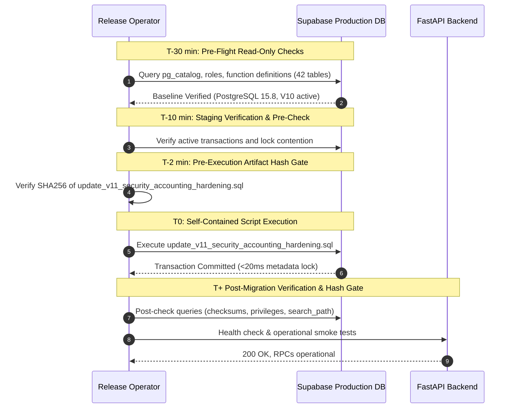

# Pet Travel Wholesale — V11 Production Execution Runbook

## Document Control
- **Document**: `docs/runbooks/V11_production_execution.md`
- **Manifest**: `docs/runbooks/V11_production_artifact_manifest.md`
- **Canonical Migration**: `supabase/update_v11_security_accounting_hardening.sql`
- **Expected Migration SHA256**: `45efbb2b3d7439a90fb4a99ce656a9d4ce50b4767dac02c19890500e0c30fa8f` (28,713 bytes)
- **Canonical Rollback**: `supabase/rollback_v11_forward_repair.sql`
- **Expected Rollback SHA256**: `5c90dda4db76183a9b54e2202988e14edb0460caf71ae95d488abd79fa5b05b3` (22,785 bytes)
- **Emergency Rollback**: `supabase/emergency/v11_forward_repair.sql`
- **Expected Emergency SHA256**: `5c90dda4db76183a9b54e2202988e14edb0460caf71ae95d488abd79fa5b05b3` (22,785 bytes)
- **Target Environment**: Production Supabase (`gfiyzwrcvsnsimwbpgbb.supabase.co`)
- **Execution Model**: Self-Contained Transaction Script (Contains `BEGIN; SET LOCAL lock_timeout='5s'; SET LOCAL statement_timeout='30s'; ... COMMIT;`)
- **Classification**: Online / Low-Impact Schema Migration

---

## 1. Executive Summary & Preconditions

The V11 migration reconciles an earlier immutable V10 applied to Supabase production, delivering:
1. Hardened `SECURITY DEFINER` procedures (`public.pt_reserve_order_stock` and `public.pt_post_order_accounting`) with `SET search_path = ''`.
2. Absolute privilege denial on `PUBLIC`, `anon`, and `authenticated` roles.
3. Explicit execution grants for trusted backend callers (`service_role`, `postgres`, and `pettravel_backend`).
4. Strict commercial source-of-truth semantics (`quote_versions.final_total` where `status = 'accepted'`).
5. Complete input validation and fail-closed error handling.

### Preconditions Checklist:
- [ ] Read-only preflight completed on production database (42/42 base tables verified).
- [ ] Database backup / point-in-time recovery (PITR) verified available.
- [ ] All 30 automated unit, integration, and security tests passing (100%).
- [ ] Staging lock timing empirically measured (Median ~8.2ms, P95 ~12.2ms).
- [ ] Rollback forward repair script tested and verified in isolation on PG15 & PG16.
- [ ] Pre-execution file hash check matches manifest exactly.

---

## 2. Chronological Execution Timeline



### T-30: Pre-Flight Inspection (Read-Only)
Run the following verification query on production:
```sql
SELECT 
    current_database(),
    current_user,
    session_user,
    version();

-- Verify 42 public base tables exist
SELECT count(*) FROM information_schema.tables 
WHERE table_schema = 'public' AND table_type = 'BASE TABLE';

-- Verify current function definitions exist
SELECT 
    p.proname,
    p.prosecdef,
    p.proconfig,
    pg_get_function_identity_arguments(p.oid) AS identity_args
FROM pg_proc p
JOIN pg_namespace n ON n.oid = p.pronamespace
WHERE n.nspname = 'public'
  AND p.proname IN ('pt_reserve_order_stock', 'pt_post_order_accounting');
```

### T-10: Lock Contention & Active Query Check
Verify there are no long-running transactions holding locks on catalog or business tables:
```sql
SELECT pid, now() - xact_start AS duration, query, state
FROM pg_stat_activity
WHERE state != 'idle' 
  AND pid != pg_backend_pid()
ORDER BY duration DESC;
```

### T-2: Pre-Execution Artifact Hash Gate
**MANDATORY CHECK**: Before executing, verify the file hash on the deployment machine:
```powershell
Get-FileHash supabase/update_v11_security_accounting_hardening.sql -Algorithm SHA256
```
- **EXPECTED HASH**: `45EFBB2B3D7439A90FB4A99CE656A9D4CE50B4767DAC02C19890500E0C30FA8F`
- **IF HASH DOES NOT MATCH**: **ABORT IMMEDIATELY**. Do not proceed.

### T0: Production Execution
Execute the self-contained migration script [`supabase/update_v11_security_accounting_hardening.sql`](file:///D:/Workspace/PetTravel%20WholeSale/supabase/update_v11_security_accounting_hardening.sql) directly.
*(Do NOT wrap in an additional outer BEGIN/COMMIT block; the script contains its own atomic transaction and session timeouts).*

```bash
psql "$DATABASE_URL" -f supabase/update_v11_security_accounting_hardening.sql
```
*Or execute the entire content of `update_v11_security_accounting_hardening.sql` once in the Supabase SQL Editor.*

### T+1: Immediate Post-Check & Function Gate
Execute the post-migration verification script:
```sql
-- 1. Verify Function Security Configuration
SELECT 
    p.proname,
    p.prosecdef,
    p.proconfig,
    pg_get_userbyid(p.proowner) AS owner,
    pg_get_function_identity_arguments(p.oid) AS identity_args
FROM pg_proc p
JOIN pg_namespace n ON n.oid = p.pronamespace
WHERE n.nspname = 'public'
  AND p.proname IN ('pt_reserve_order_stock', 'pt_post_order_accounting');

-- 2. Verify Absolute Revocation for PUBLIC, anon, authenticated
SELECT 
    p.proname,
    has_function_privilege('public', p.oid, 'EXECUTE') AS public_exec,
    has_function_privilege('anon', p.oid, 'EXECUTE') AS anon_exec,
    has_function_privilege('authenticated', p.oid, 'EXECUTE') AS authenticated_exec,
    has_function_privilege('service_role', p.oid, 'EXECUTE') AS service_role_exec,
    has_function_privilege('postgres', p.oid, 'EXECUTE') AS postgres_exec
FROM pg_proc p
JOIN pg_namespace n ON n.oid = p.pronamespace
WHERE n.nspname = 'public'
  AND p.proname IN ('pt_reserve_order_stock', 'pt_post_order_accounting');
```
*Expected Post-Check Results:*
- `public_exec`: `FALSE`
- `anon_exec`: `FALSE`
- `authenticated_exec`: `FALSE`
- `service_role_exec`: `TRUE`
- `postgres_exec`: `TRUE`
- `prosecdef`: `TRUE`
- `proconfig`: `{"search_path="}`

---

## 3. Fast Rollback Decision Tree & Execution Plan

### Rollback Decision Triggers:
| Trigger ID | Condition | Immediate Action |
|---|---|---|
| **TR-01** | Migration script errors / aborts / hits lock timeout | **Automatic Rollback** (Handled atomically by Postgres; state untouched) |
| **TR-02** | Post-check reveals `anon` or `authenticated` has EXECUTE privilege | **Execute Emergency Forward Repair Rollback** |
| **TR-03** | Backend application returns 500 / 42501 on order lock or payment confirmation | **Execute Forward Repair Rollback** |
| **TR-04** | Latency degradation or unresolvable lock contention | **Execute Forward Repair Rollback** |

### Rollback Script Execution:
1. Verify Rollback Artifact SHA256:
```powershell
Get-FileHash supabase/rollback_v11_forward_repair.sql -Algorithm SHA256
```
- **EXPECTED HASH**: `5C90DDA4DB76183A9B54E2202988E14EDB0460CAF71AE95D488ABD79FA5B05B3`

2. Execute [`supabase/rollback_v11_forward_repair.sql`](file:///D:/Workspace/PetTravel%20WholeSale/supabase/rollback_v11_forward_repair.sql):
```bash
psql "$DATABASE_URL" -f supabase/rollback_v11_forward_repair.sql
```

### Rollback Verification Query:
```sql
SELECT 
    p.proname,
    p.prosecdef,
    p.proconfig,
    has_function_privilege('authenticated', p.oid, 'EXECUTE') AS auth_exec,
    has_function_privilege('service_role', p.oid, 'EXECUTE') AS service_exec
FROM pg_proc p
JOIN pg_namespace n ON n.oid = p.pronamespace
WHERE n.nspname = 'public'
  AND p.proname IN ('pt_reserve_order_stock', 'pt_post_order_accounting');
```
*Verification Invariant*: `auth_exec` must be `FALSE`, `service_exec` must be `TRUE`, `search_path` must remain empty `""`. Security boundaries are NEVER regressed.
