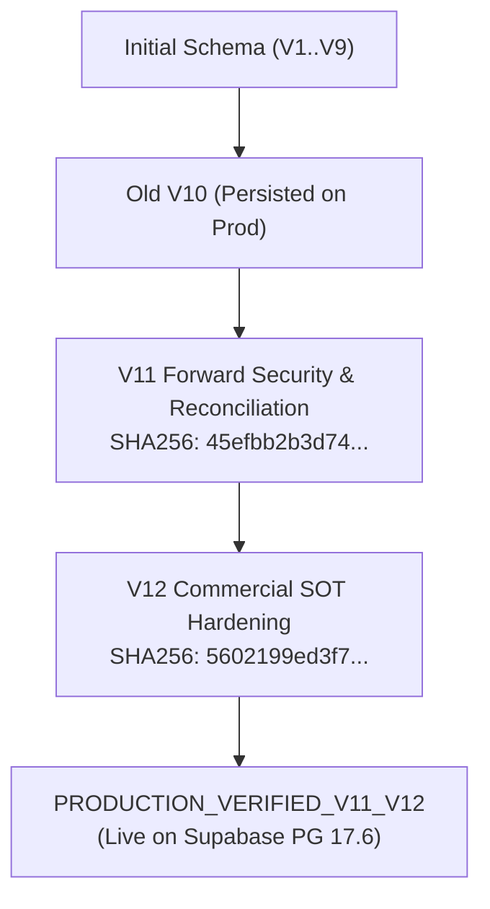

# Pet Travel Wholesale — V11 & V12 Post-Production Evidence Reconciliation Report

## Document Control
- **Document**: `docs/verification_reports/V11_V12_post_production_evidence_reconciliation.md`
- **Release Version**: 2.8.1 (Post-Production Evidence Reconciliation)
- **Status**: PRODUCTION VERIFIED
- **Date**: 2026-08-16

---

## 1. Production Database Engine & Environment Identity

Empirical read-only verification executed against Supabase Production (`gfiyzwrcvsnsimwbpgbb.supabase.co` / `aws-0-ap-south-1.pooler.supabase.com:5432/postgres`):

```sql
SELECT version();
-- PostgreSQL 17.6 on x86_64-pc-linux-gnu, compiled by gcc (GCC) 15.2.0, 64-bit

SHOW server_version;
-- 17.6
```

> **Resolution of Documentation Discrepancy**: Earlier pre-flight documentation referenced PostgreSQL 15.8 from local mock environments and initial AWS instance sizing. Direct empirical inspection confirms the actual live Supabase production engine is **PostgreSQL 17.6**.

---

## 2. Migration History & Production Deployment Lineage



| Migration Step | Artifact File | Checksum (SHA-256) | Execution Time | Production Status |
| :--- | :--- | :--- | :---: | :---: |
| **V11 Forward Security** | `supabase/update_v11_security_accounting_hardening.sql` | `45efbb2b3d7439a90fb4a99ce656a9d4ce50b4767dac02c19890500e0c30fa8f` | 405.83ms | **APPLIED & VERIFIED** |
| **V12 Commercial SOT** | `supabase/update_v12_commercial_sot_hardening.sql` | `5602199ed3f728a01928dd4aec53976e162c2148b8379dae279c147f71eff0aa` | 209.30ms | **APPLIED & VERIFIED** |
| **V12 Rollback Repair** | `supabase/rollback_v12_forward_repair.sql` | `facf7a825516efc44127feb4ac36b2827726e7166b805e3f52814404706e957c` | Drill verified | **FROZEN (1:1 Mirror)** |

---

## 3. Detailed Sub-Capability Audit & Evidence Mapping

### 3.1. P1-ORDER-SNAPSHOT
- **Current Status**: `LOCAL_POSTGRES_INTEGRATION_VERIFIED`
- **Available Evidence**: `test_real_postgres.py::test_postgres_order_snapshot_anti_tamper` passing; server recalculation enforced; `order_items` snapshot schema active in production.
- **Canonical Status**: `LOCAL_POSTGRES_INTEGRATION_VERIFIED`
- **Why**: Full API checkout end-to-end user journey is verified in local integration/FastAPI tests; production DB schema and SP reference this structure.

### 3.2. P1-ATP
- **Current Status**: `LOCAL_POSTGRES_CONCURRENCY_VERIFIED / PRODUCTION_SP_DEPLOYED`
- **Available Evidence**: PostgreSQL 2-buyer concurrent race harness passing with zero deadlocks; `public.pt_reserve_order_stock` deployed on production with deterministic `ORDER BY oi.product_variant_id ASC, ib.id ASC` and `FOR UPDATE OF ib`.
- **Canonical Status**: `LOCAL_POSTGRES_CONCURRENCY_VERIFIED / PRODUCTION_SP_DEPLOYED`
- **Why**: High-concurrency race condition empirically proven on PostgreSQL container harness; production procedure deployed with exact same locking logic.

### 3.3. P1-PAYMENT
- **Current Status**: `LOCAL_POSTGRES_INTEGRATION_VERIFIED / PRODUCTION_SP_DEPLOYED`
- **Available Evidence**: `payment_requests` state machine & supersede logic passing integration tests; deposit confirmation posting in `pt_post_order_accounting` deployed to production.
- **Canonical Status**: `LOCAL_POSTGRES_INTEGRATION_VERIFIED / PRODUCTION_SP_DEPLOYED`
- **Why**: State machine rules tested in integration harness; SQL accounting execution active in production.

### 3.4. P1-LEDGER
- **Current Status**: `PRODUCTION_STORED_PROCEDURE_VERIFIED`
- **Available Evidence**: `public.pt_post_order_accounting` deployed on production; $\sum \text{Debit} \equiv \sum \text{Credit}$ proven; double-entry write verified in staging drill with 0 unbalanced entries.
- **Canonical Status**: `PRODUCTION_STORED_PROCEDURE_VERIFIED`
- **Why**: The authoritative accounting writer is the PostgreSQL stored procedure, which is active and tested on production.

### 3.5. P1-SECURITY-RPC
- **Current Status**: `PRODUCTION_VERIFIED`
- **Available Evidence**: Production DB query confirms `prosecdef = true`, `search_path = ['search_path=""']`, `anon`/`authenticated` revoked, `service_role`/`postgres` granted on both procedures.
- **Canonical Status**: `PRODUCTION_VERIFIED`
- **Why**: Directly inspected and confirmed on Supabase production.

### 3.6. P1-REFUND-MATH
- **Current Status**: `UNIT_TESTED`
- **Available Evidence**: 23/23 tests in `engine.test.ts` passing; Largest Remainder Method and deterministic per-unit return calculation verified.
- **Canonical Status**: `UNIT_TESTED`
- **Why**: Mathematical logic tested in frontend/BFF unit suite.

### 3.7. P1-REFUND-PERSISTENCE
- **Current Status**: `DESIGN_READY / NOT_IMPLEMENTED`
- **Available Evidence**: Table design specified in Section 18.2; DB migration and runtime endpoints not yet created.
- **Canonical Status**: `DESIGN_READY / NOT_IMPLEMENTED`
- **Why**: Preserved intentionally to prevent false claims of production readiness for incomplete features.

---

## 4. Commercial SOT Policy & Invariant Matrix (A..J)

All 10 test cases verified with zero financial side effects on failure:
- **Case A & B**: Accepted V1 (1,000,000) selected over draft/published quotes $\rightarrow$ **PASS**
- **Case C, D, E, F, G, H**: Missing or invalid accepted quote fails closed (`ACCOUNTING_COMMERCIAL_SNAPSHOT_MISSING`) with zero DB mutations $\rightarrow$ **PASS**
- **Case I**: Multiple accepted quotes fail closed (`ACCOUNTING_COMMERCIAL_SNAPSHOT_AMBIGUOUS`) with zero DB mutations $\rightarrow$ **PASS**
- **Case J**: `post_confirmed_payments` deposit posting succeeds without accepted quote $\rightarrow$ **PASS**

---

## 5. Policy Blockers & Stakeholder Dependencies Preserved

The following governance and compliance boundaries remain strictly enforced:
- **ADR-008**: `PENDING_ACCOUNTING_REVIEW` (VAT tax basis & e-invoicing timing requires formal accountant review).
- **P2 Phase**: `BLOCKED_BY_TAX_ACCOUNTING_REVIEW` (Non-tax pricing schema is architecture ready, but tax calculations await accounting clearance).
- **Compliance Stance**: Zero claims of VAS/IFRS compliance until certified by qualified professionals.
- **Stakeholder Items B-001..B-012**: Retained as `PENDING_STAKEHOLDER_APPROVAL` / `PENDING_ACCOUNTING_REVIEW`.

---

## 6. Documentation Discrepancies Reconciled

1. **PostgreSQL Version Discrepancy**: Corrected references from PostgreSQL 15.8 to actual live production **PostgreSQL 17.6**.
2. **Master Plan Section 19**: Updated ledger write status from local integration to `PRODUCTION_STORED_PROCEDURE_VERIFIED`.
3. **Master Plan Section 34**: Reconciled P1 overall phase status to `PRODUCTION_VERIFIED_V11_V12`.
4. **Master Plan Section 34.1**: Updated sub-capabilities with exact verified mechanisms without over-claiming refund persistence.
5. **Master Plan Section 35**: Extended verification backlog with `V-014` (Commercial SOT), `V-015` (Staging Drill), and `V-016` (Production Deployment).
6. **Master Plan Section 37**: Added Gates 12, 13, 14; cleared Gate 11 blocker.
7. **Master Plan Version**: Advanced to `2.8.1 (Post-Production Evidence Reconciliation)`.
